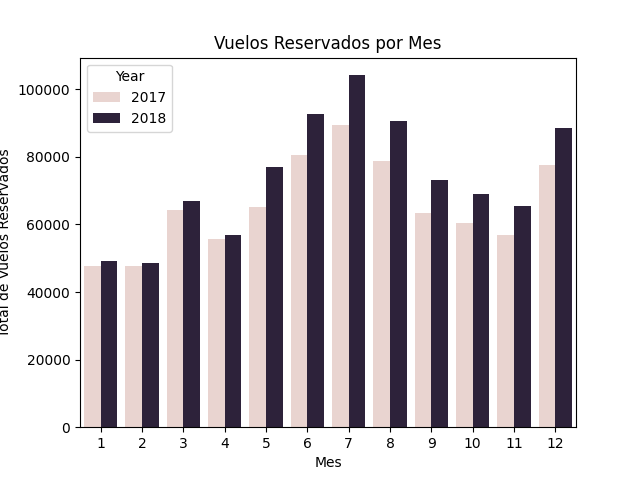
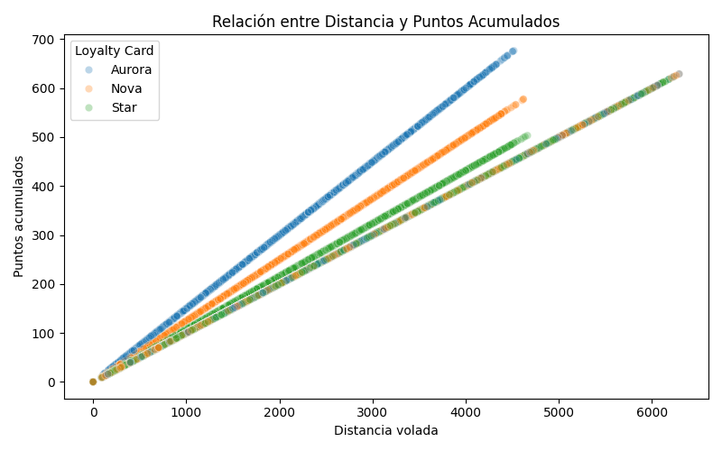
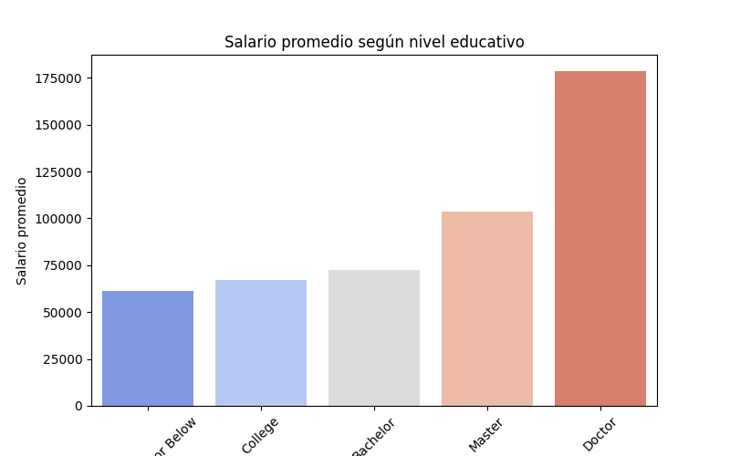

## Análisis Exploratorio, Limpieza y Visualización de Datos de un Programa de Lealtad Aéreo
### 🧩 Descripción del Proyecto

Este repositorio contiene el desarrollo completo de la evaluación final del Módulo 3: Transformando Datos, del Bootcamp de Data Analysis & IA.
El ejercicio consiste en analizar dos bases de datos relacionadas con el comportamiento de clientes dentro del programa de fidelización de una aerolínea, realizar una Fase 1 de limpieza y tratamiento de datos, y una Fase 2 de análisis visual, aplicando técnicas estudiadas durante el módulo: exploración estadística, gestión de valores nulos, outliers, correlaciones y visualización con matplotlib y seaborn.

El proyecto está organizado siguiendo buenas prácticas de estructura, documentación, versionado y legibilidad del código.

### 📁 Estructura del Repositorio

```python
├── files/
│   ├── Customer Flight Activity.csv
│   ├── Customer Loyalty History.csv
│   └── customer_summary.csv        # generado en Fase 1 (no incluido por peso)
│
├── images/
│   ├── relacion_distancia_puntos.png
│   ├── relacion_salariopromedio_educacion.png
│   └── relacion_totalvuelos_mes.png  
│
├── src/
│   ├── soporte_eda.py
│   ├── soporte_correlacion.py
│   └── __pycache__/
│
├── Fase1_EDA_ETL.ipynb
├── Fase1_EDA_ETL_SinOutputCells.ipynb
├── Fase2_Analisis_Visualización.ipynb
│
├── Fase1_documentacion.md
├── Fase2_documentacion.md
│
├── evaluacion-final.md
├── .gitignore
└── README.md
```

### 🎯 Objetivo General

Analizar y comprender el comportamiento de los clientes dentro de un programa de fidelidad de una aerolínea, mediante:

- Fase 1: Exploración, limpieza y transformación de datos.

- Fase 2: Generación de visualizaciones para responder a preguntas analíticas clave.

#### 🧪 **Fase 1** – Exploración, Limpieza y Transformación (EDA + ETL)

En esta fase se realizaron múltiples tareas técnicas para garantizar que los datos fueran correctos, consistentes y adecuados para el análisis.

✔️ Tareas principales realizadas

- Análisis exploratorio completo de ambos archivos CSV.

- Detección y eliminación de 1.864 filas duplicadas en Customer Flight Activity.

- Revisión completa de valores nulos, tipos de datos, outliers y estadísticas descriptivas.

- Limpieza y corrección de valores erróneos (ej. salarios negativos → valor absoluto).

- Decisiones fundamentadas respecto a:

        - Manejo de nulos en Salary y Cancellation.

        - Imputación basada en la relación entre Education y Salary.

        - Validación de correlaciones y comportamiento de variables con distribuciones altamente sesgadas.

        - Unificación de datasets mediante inner join en la clave Loyalty Number.

        - Generación del archivo final limpio: customer_summary.csv. 
        Nota: Por peso, customer_summary.csv no se incluye en el repositorio; debe generarse ejecutando la última celda del notebook de Fase 1.


#### 📊 **Fase 2** – Análisis y Visualización

En esta fase se elaboraron visualizaciones para responder las preguntas analíticas indicadas en el enunciado.

🔍 Principales conclusiones:

1️⃣ Distribución de vuelos reservados por mes

- Se identifica una estacionalidad clara.

- Meses con mayor actividad: junio, julio, agosto y diciembre.

- Meses con menor actividad: enero, febrero, marzo, abril y noviembre.



*Figura 1: Gráfico de barras que muestra la cantidad de vuelos reservados por mes, evidenciando estacionalidad.*

2️⃣ Relación entre distancia y puntos acumulados

- Fuerte correlación positiva.

- Las líneas de tendencia diferenciadas se explican por la variable Loyalty Card.

- Aurora: la que más puntos acumula por unidad de distancia.

- Star: la que menos.

- Next step recomendado: investigar el patrón de la 4ª línea residual detectada.



*Figura 2: Scatterplot que muestra la relación entre la distancia volada y los puntos acumulados, diferenciando por tipo de tarjeta de lealtad.*


3️⃣ Distribución de clientes por provincia

- Concentración geográfica en:
Ontario (32%), British Columbia (26%) y Quebec (20%).

4️⃣ Salario promedio por nivel educativo

- Relación ascendente esperada: mayor educación → mayor salario.

- Salarios imputados para College colocados coherentemente entre High School y Bachelor.



*Figura 3: Salario promedio según el nivel educativo.*


5️⃣ Proporción de clientes por tipo de tarjeta

- Star: 45.6%

- Nova: 33.9%

- Aurora: 20.5%

- Implicación: la base de clientes está concentrada en niveles inferiores e intermedios.

6️⃣ Estado civil y género

- Distribución equilibrada por género en todos los estados civiles.

- Mayoría de clientes casados (~58%).

- Divorciados y solteros con proporciones muy similares entre géneros.

🛠️ Tecnologías y Librerías Utilizadas

- Python 3.11

- Pandas

- NumPy

- Matplotlib

- Seaborn

- Jupyter Notebooks

- Git & GitHub

---

### 📌 Decisiones Técnicas Relevantes

- Se mantuvieron los nombres originales de columnas para evitar conflictos con datasets previos.

- Se corrigieron salarios negativos por tratarse de errores evidentes de carga.

- Se imputaron nulos de Salary con criterio estadístico basado en niveles educativos.

- Nulos en Cancellation se conservaron, ya que representan clientes activos.

- Se evitó subir archivos generados de gran tamaño al repositorio (p. ej. customer_summary.csv).

🚀 **Próximos Pasos - Next Steps (Recomendados)**

- Análisis de los outliers extremos identificados en variables como Points Accumulated o Total Flights.

- Profundizar en la cuarta línea detectada en scatterplots de puntos acumulados vs distancia.

- Generación de segmentaciones avanzadas de clientes (clustering).

- Modelos predictivos básicos para churn (pérdida de clientes) o clasificación de nivel de tarjeta.

-----

### 👩‍💻 Autoría

Gisela Barroso

### 📝 Licencia

Este proyecto se distribuye únicamente con fines educativos.
